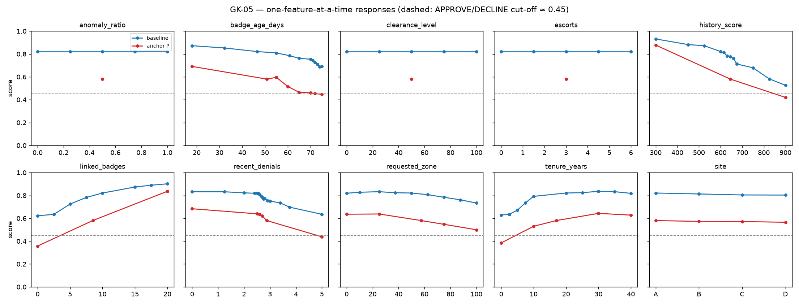

# round-1 — Observe

**Team:** BB-001
**System:** GK-05 (building access control → `score` ∈ [0,1], `decision` APPROVE/DECLINE)
**Queries used:** 145 / 150

## What we concluded

- **Six of the nine numeric inputs, plus `site`, move the score.** Ranked by how far one input alone moves the score
  from the all-midpoint baseline:
  `history_score` (↓, ~0.41) > `linked_badges` (↑, ~0.28) > `tenure_years` (↑, peak ~30–35, then slightly ↓; ~0.21) ≈
  `recent_denials` (↓, ~0.20) > `badge_age_days` (↓, ~0.18) > `requested_zone` (↓ above ~25, ~0.10) >
  `site` (A > B > C > D, ≤0.02).
- **`anomaly_ratio`, `clearance_level` and `escorts` have no detectable effect.** The output was identical to all
  four reported decimals across each one's full range, at three very different operating points, at all four sites,
  and with all three changed at once.
- **The decision is a cut-off on the score at 0.450 ± 0.004, not 0.5.** It is bracketed between 0.4466 (DECLINE) and
  0.4541 (APPROVE). All 145 queries agree with "APPROVE iff score > ~0.45", so we see no separate decision rule.
- **The system is deterministic**, including right next to the cut-off.
- **Where the curves bend:**
  - `recent_denials` is almost flat to ~2.55, then falls steeply between 2.55 and 2.75.
  - `tenure_years` rises fastest between 5 and 10.
  - `linked_badges` rises fastest between 2.5 and 5, with diminishing returns above 10.
  - `history_score` falls monotonically but in uneven, step-like stretches.
- **`badge_age_days` always lowers the score, but *where* it bites depends on the other inputs.** At the baseline it
  falls sharply between 70 and 74. At a second operating point the sharp fall is at 55–65 and it is flat after that.
  This is our strongest evidence that one-at-a-time analysis stops explaining the system, i.e. an interaction.

## How we got there

1. **Baseline and determinism (2 queries).** We set every input to its range midpoint with site A, and sent the same
   query twice: 0.8213 both times. One repeat is the cheapest way to tell signal from noise.
2. **One-at-a-time screen (39 queries).** Each numeric input was set to 0/25/75/100 % of its range with everything else
   held at the midpoint, and sites B, C and D were tried the same way. That is enough to see the direction, any
   curvature and big jumps without a blind fine sweep. This found six active inputs and three exactly flat ones.
3. **"Ignored" or only "flat here"? (23 queries).** Exact flatness at one point can't separate an ignored input from
   one that only acts elsewhere or together with another input. So we re-tested the three flat inputs at a
   deep-DECLINE corner (0.0529) and a deep-APPROVE corner (0.9829), and at four joint corners of all three. All
   were identical. The same batch included five `recent_denials` points that ruled out integer rounding.
4. **Finding the decision cut-off (14 queries).** No DECLINE had been seen yet. We walked the straight line from the
   baseline to the low corner, coarse first and then by bisection, and checked a second path. The cut-off lies
   between 0.4404 and 0.4595, not 0.5.
5. **Second operating point P (19 queries).** We repeated the screen around a point near the cut-off (0.580), where
   single moves can also flip the decision. All directions replicated, and the cut-off bracket narrowed.
6. **Shape detail and coverage (9 queries).** Bends in `tenure_years`, `badge_age_days` and `recent_denials`; the
   ignored inputs at sites B and C; and a repeat of the query nearest the cut-off.
7. **Refinement, once the budget was confirmed per-round (25 queries).** We located the bends to within one unit,
   confirmed the `tenure_years` peak, and filled gaps in `history_score`, `linked_badges` and `requested_zone`. A
   2×2 of `history_score` × `linked_badges` tested whether the two strongest inputs add up: on the log-odds scale they
   nearly do (+1.78 vs +1.54).
8. **Do bends stay put? (13 queries).** A 15-unit `history_score` sweep showed step-like structure. Re-checking the
   `badge_age_days` and `recent_denials` bends at point P showed that the `badge_age_days` bend **moves**, from 70–74
   to 55–65.

The full chronological diary, with each experiment's question, hypotheses and outcome, is in `experiments/analysis.md`.
Every query (inputs, outputs, `request_id`, `query_index`) is in `experiments/queries.csv`.

## What we ruled out

- **Decision cut-off at 0.5.** Scores of 0.4541, 0.4595 and 0.4999 are all APPROVE.
- **Randomness in the output.** Identical repeats returned identical scores, at the baseline and at the cut-off.
- **`recent_denials` rounded to whole numbers before use.** 2.4 scores differently from 2.0 (.819 vs .823), and 2.6
  differently from 3.0 (.808 vs .751).
- **`recent_denials` acting as one clean step.** The drop is spread over 2.55–2.75 and continues more slowly after,
  with small wiggles (2.4 is just below 2.5, and 2.8 just above 2.75).
- **`tenure_years` increasing all the way (our first reading).** It peaks at ~30–35 and falls at 40, at both
  operating points.
- **`requested_zone` peaking sharply near 25.** At point P, 0 and 25 are equal. It is better described as flat or
  slightly rising to ~25, then decreasing.
- **`badge_age_days` having one fixed threshold.** Its bend is at 70–74 at the baseline but 55–65 at P. We report a
  baseline bend only with low confidence.
- **The three flat inputs acting only in combination.** All four joint corners of anomaly × clearance × escorts gave
  exactly the baseline score.
- **An override rule on the decision.** None of 145 queries is APPROVE below or DECLINE above the cut-off.

## What we are still unsure about

- **Which input moves the `badge_age_days` bend.** Point P differs from the baseline in five inputs: `history_score`,
  `linked_badges`, `recent_denials`, `requested_zone` and `tenure_years`. Finding the partner is our first Round 2
  experiment.
- **Whether the score comes from a tree ensemble.** Step-like segments in `history_score` and small non-monotone
  wiggles (`recent_denials` 2.4/2.8, `badge_age_days` 74→75 and 50.8→55, the score floor near 0.05) are typical of
  averaged trees. That is not proof. A smooth model with an interaction could explain some of it, but not the plateaus.
- **"Ignored" is limited by resolution and coverage.** The score has 4 decimals, so an effect below ~0.0001 would be
  invisible. A region we never visited could still use these inputs.
- **The decline after the `tenure_years` peak is small** (~0.015). It replicated, but it is the weakest shape claim.
- **The low-score region (~0.05) is unexplored.** The score was not monotone there (0.0453, then 0.0581 at the corner).
  That is a Round 3 candidate.
